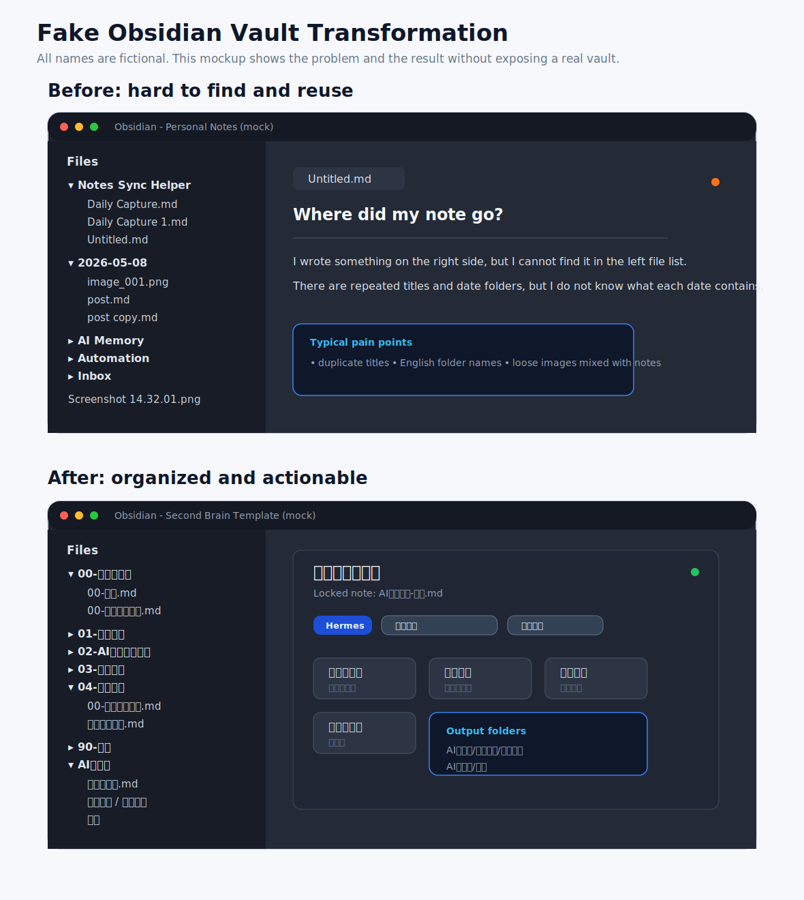
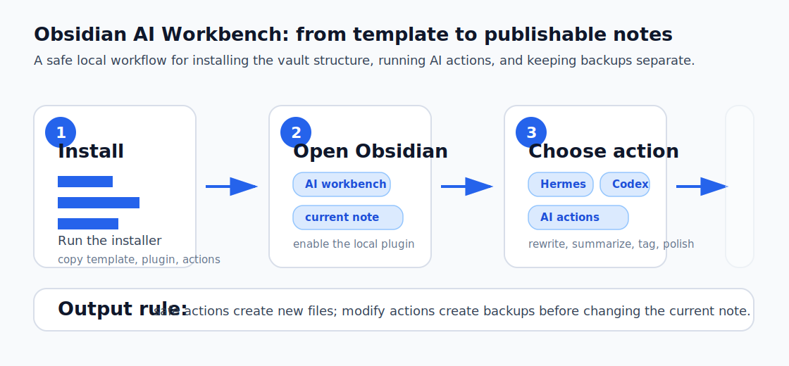
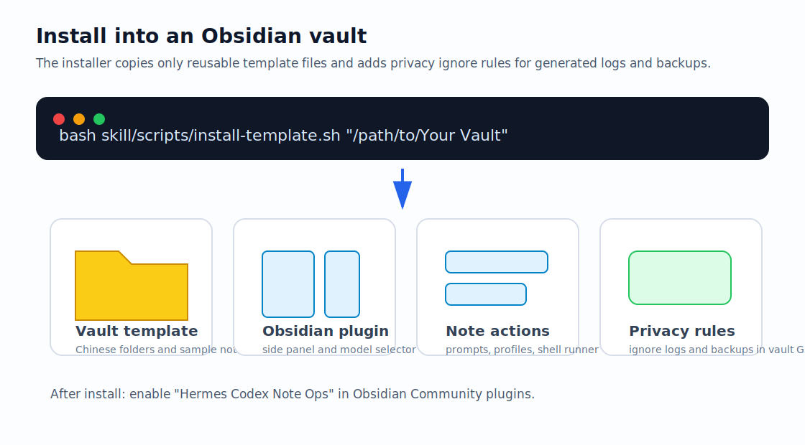
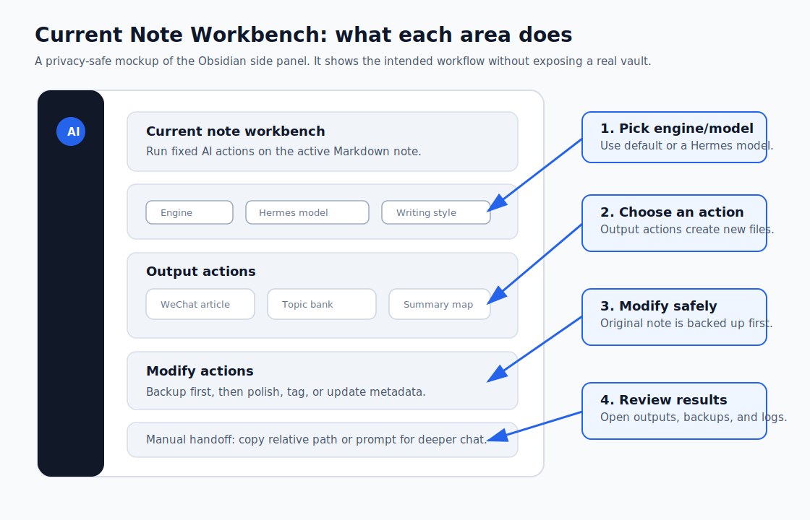

# Visual Usage Guide

Use this guide when explaining the template to a human user, writing onboarding docs, or helping someone install and operate the Obsidian AI workbench.

## 1. Workflow Overview



The before/after image is a fictional mock Obsidian screenshot. It uses fake folder names, fake note titles, and fake media filenames to make the transformation easy to understand without exposing a real vault.



The workbench flow is:

1. Install the reusable Vault template and plugin files.
2. Open Obsidian and enable `Hermes Codex Note Ops`.
3. Open a Markdown note and choose an AI action.
4. Review generated outputs or restore backups when a modify action changed the source note.

## 2. Installation Flow



Run the installer from the repository root:

```bash
bash skill/scripts/install-template.sh "/path/to/Your Obsidian Vault"
```

The installer copies:

- Chinese Vault navigation templates
- the Obsidian plugin
- note action prompts and style profiles
- privacy `.gitignore` rules for generated logs and backups

## 3. Workbench UI Map



In Obsidian:

1. Open a normal Markdown note.
2. Open the side-ribbon workbench icon.
3. Pick engine, Hermes model, and writing style.
4. Use output actions for safe exploration.
5. Use modify actions only when you are comfortable with an automatic backup and replacement.
